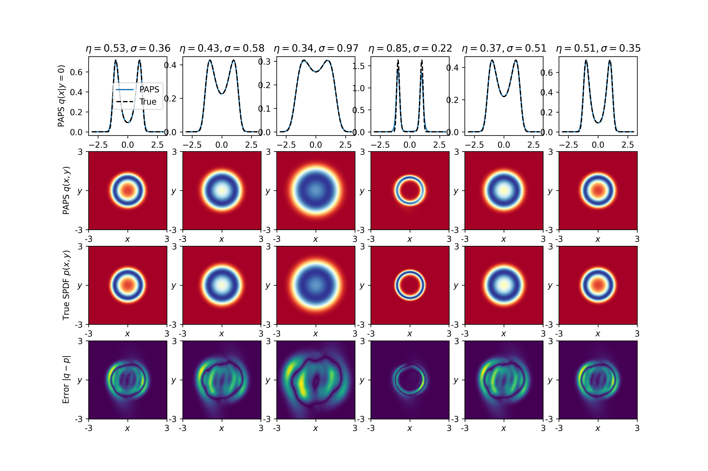

# PAPS
The pseudo-analytical probability solution

This repository contains the implementation code for our paper titled 'The pseudo-analytical probability solution to parameterized Fokker-Planck equations via deep learning'. In this work, we propose the pseudo-analytical probability solution (PAPS) for solving Fokker-Planck equations with multiple variable system parameters. The paper has been accepted for publication in Engineering Applications of Artificial Intelligence. The preprint version is available here: https://arxiv.org/abs/2503.09073.

# Usage

## Quick test

The implementation provides four numerical examples of the PAPS, corresponding to the 1D, 2D, 4D, and 6D systems in the paper. Each example is encapsulated in a separate Python file. To visualize results for any system:

(1) Navigate to the main() function in the respective file.

(2) Execute test_xx_system() to quickly generate some random system parameters and draw the numerical solutions by the PAPS.

You may see figures like these.



## Train new models

To train a new PAPS:

Uncomment and run the train_xx_system() function in the same file. Note that the code has been implemented in Pytorch and tested on a GeForce RTX 4090 GPU with 24 GB memory. For GPUs with limited memory, less sample sizes should be selected to avoid memory overflow, e.g., decreasing N_system and N_point. Please see model.py file for more instruction.

While the four files share a common structure, each incorporates system-specific Fokker-Planck operators and parameter ranges. Key customization points are marked with the comment "please change here". Modify these sections to adapt the code for alternative systems or configurations.

## Important Note

The PAPS is specifically designed for parameterized Fokker-Planck equations with unique stationary solutions. For systems exhibiting multiple coexisting stationary solutions, the PAPS may converge to an arbitrary combination of these solutions, which might not match the desired outcome.

Should you encounter any issues, please do not hesitate to contact me for assistance: 

Xiaolong Wang

School of Mathematics and Statistics, Shaanxi Normal University, Xi’an, 710119, China

Email: xiaolongwang@snnu.edu.cn

# citation: 
```bibtex
@article{wang2025pseudo,
      title={The pseudo-analytical density solution to parameterized {F}okker-{P}lanck equations via deep learning},
      author={Xiaolong Wang and Jing Feng and Gege Wang and Tong Li and Yong Xu},
      year={2025},
      volume={2503.09073},
      journal={arXiv},
}

